# SUPERSTORE-SALES-DATA-ANALYSIS
## Introduction 
Data is very crucial for the success of any business, and superstore is no exception. This company is looking to make an informed decision in the coming year, 2024, and to do this, they require a detailed analysis of their current sale to know what is working and what is not. I will perform a detailed company analysis and provide my findings to the general manager. 
## Data Sourcing 
The data was provided to me via Google Drive, and It contains one sheet with 9995 rows(one of which is the column names) and 21 columns. The column headings are as follows: Row ID, Order ID, Order Date, Ship Date, Ship Mode, Customer ID, Customer Name, Segment, Country, City, State, Postal Code, Region, Product ID, Category, Sub-Category, Product Name, Sales, Quantity, Discount and Profit.

## Data Cleaning 
After getting the data,  I cleaned it to make it look more appealing to viewers. For this process, I edited the titles in the first row (i.e., row with row ID, order ID, ship date, etc.). I made data in that row bold and larger than the entire data set and also added colour to that row by highlighting the row and clicking on home-fill to add colour. In this step, I also adjusted all 21 columns so that the text in the columns was not congested. To do this, I put my cursor on the end of the line and dragged the column to my desired size. To further make the data appealing to viewers, I created borders around the data set. I did this by highlighting the entire data set (ctrl.+A) and clicking on the home page, the border icon and all borders. In this project, I will be working with dates a lot, so I decided to edit my date format to the appropriate format. I highlighted columns C and D  and changed the format from general to date.

### Data Before 
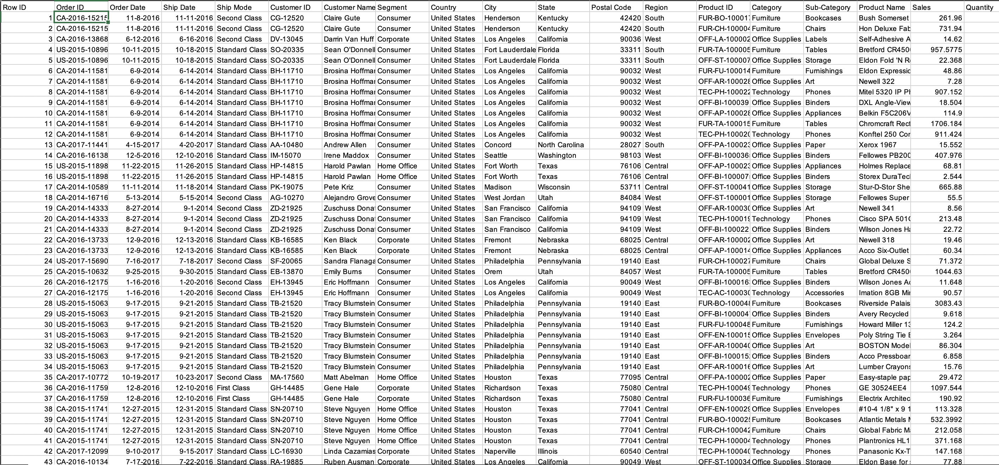 

### Data After
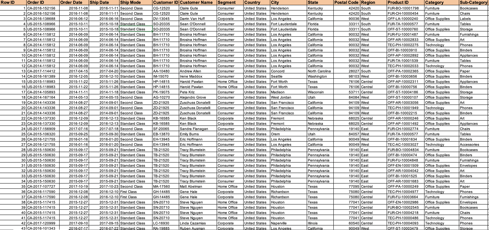 

## Problem Statement 
1. What category produced the highest revenue/profit 
2. What is the total profit generated across different regions? 
3. What is the number of sales made across different regions?
4. What shipping method is frequently used to transport products 
5. Which product segment is the most discounted? 
6. What are the 3 top states by sales? 

## Solution 
- To solve these problems, I used the Pivot table to visualize my solution.
- To create the pivot table, I selected the data range. 
- Then, I selected PivotTable from the insert tab on the ribbon and set it to a new worksheet.

## Question 1 
What category produced the highest revenue and profit? 
In the new worksheet, I dragged sales and profit to the value section and the category to the row section. The table below was produced. I adjusted the colour by clicking the design on the ribbon and adjusting the colour to my preferred colour. In addition, I used the filter button to have the sales data in descending order. 

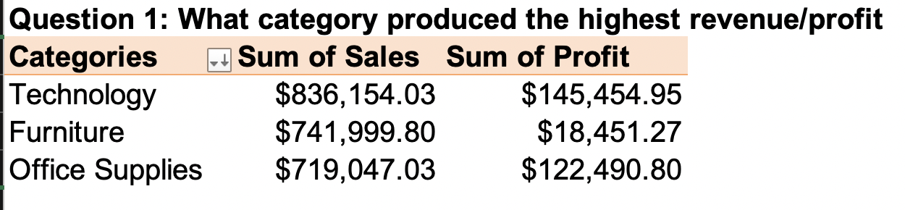 

To further visualize the data, I turned this table into a chart by clicking on the table and selecting PivotTableAnalyze on the ribbon, and then I clicked the pivot chart, which produced the column chart below. The column chart is suitable for this analysis because it puts all data side by side, which helps for easy assessment. 

 

The diagram above shows the revenue and profit based on different categories. This shows that technology has the largest sales and profit while office supplies have the lowest and second highest profits. In the case of furniture, it shows that they are making quite a number of sales but not as much profit compared to the other two categories.

## Question 2 
 What is the total profit generated across different regions? 
Like the first question, I selected the data range and then clicked on the insert tab on the ribbon. I then selected PivotTable this time; instead of clicking on a new worksheet, I selected an existing worksheet so that all my visuals were on one worksheet. To get the total profit generated across different regions, I dragged the region to the row section of the pivot table and the profit to the values section of the pivot table, which produced the table below:
 
For my diagram, I formatted the profit section in descending order by clicking on the filter button ( beside the region), clicking on descending and then sorting by the sum of profit. To further analyze this table, I turned the table into a chart by clicking on the table and selecting PivotTableAnalyze on the ribbon, and then I clicked the pivot chart, which produced the column chart below. The column chart is idle for this analysis because it shows the decreasing order region by region 
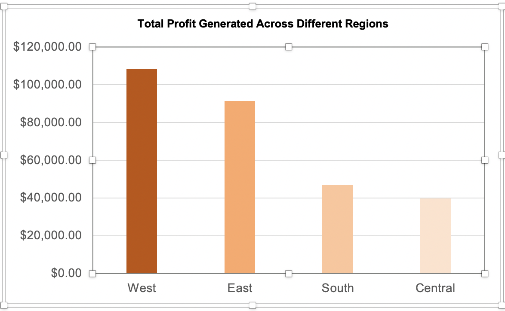 

 ## Question 3 
 What is the number of sales made across different regions?
 In this case, I dragged the sales value to the values section and kept the region in the column section. From that, I got this table. 
  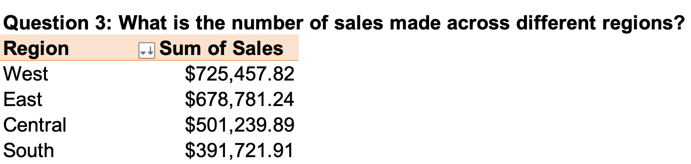 

 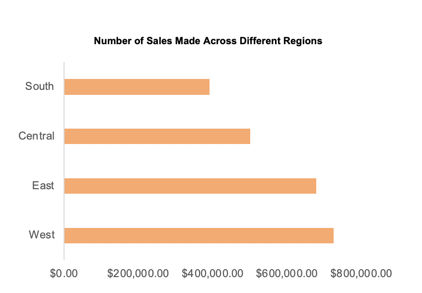 

 ## Question 4 
 What shipping method is frequently used to transport products 

  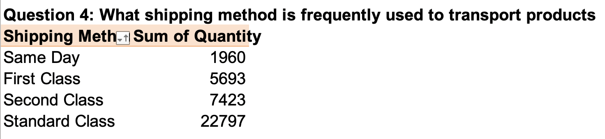 

 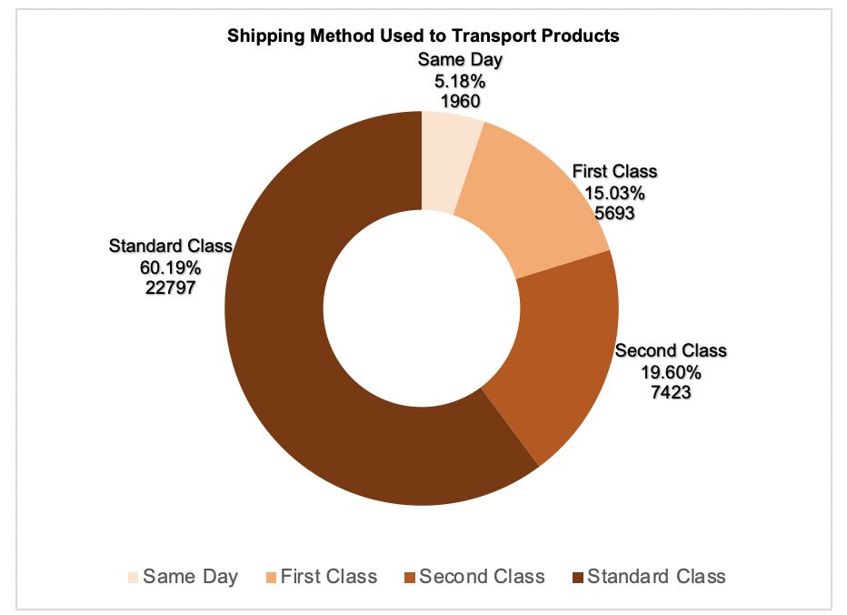 

 ## Question 5 
 Which product segment is the most discounted? 
  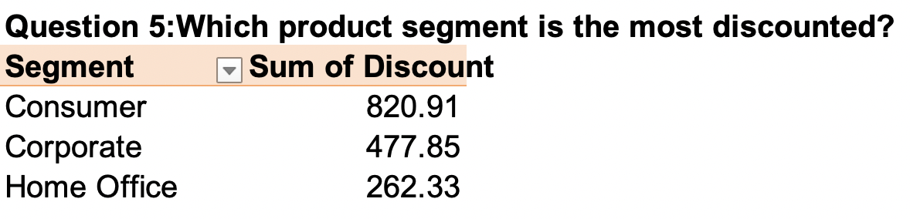 

  

 ## Question 6 

 What are the 3 top states by sales? 
  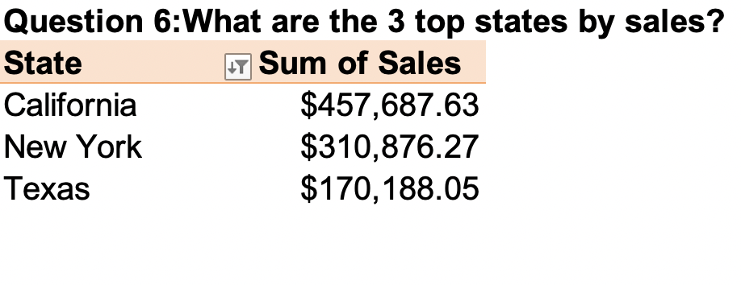 

 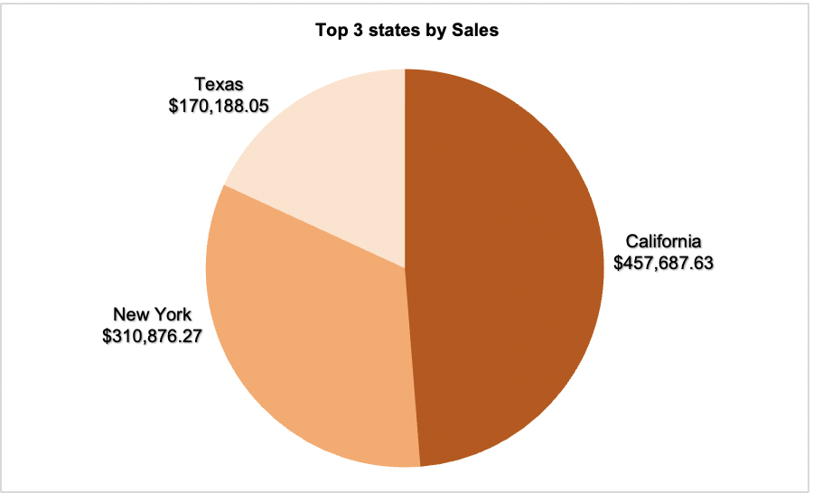 
 

