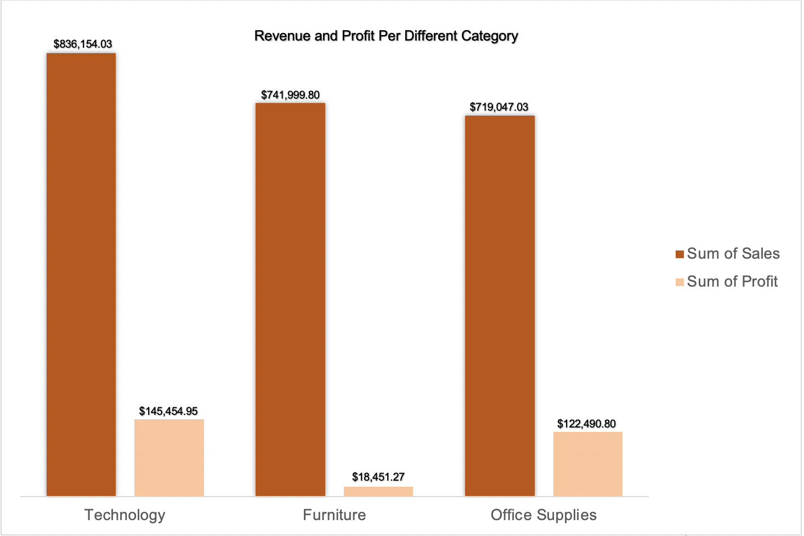
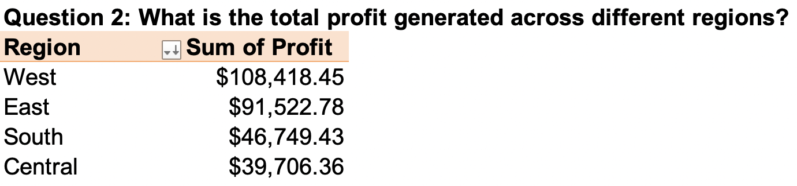
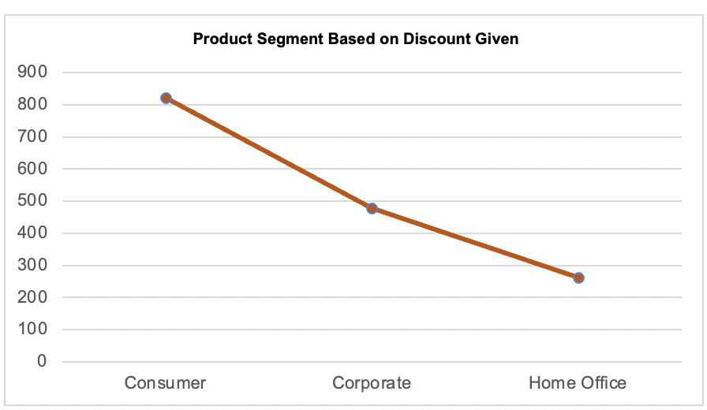

# SUPERSTORE-SALES-DATA-ANALYSIS
## Introduction 
Data is very crucial for the success of any business, and superstore is no exception. Superstore is looking to make an informed decision about the organization, and they have provided me with data from 2014 - 2018. With the data provided, I will gather valuable insights that will inform the organization about current trends and provide them with valuable information that will help the organization in the long run.
## Data Sourcing 
The data was provided to me via Google Drive, and It contains one sheet with 9995 rows(one of which is the column names) and 21 columns. The column headings are as follows: Row ID, Order ID, Order Date, Ship Date, Ship Mode, Customer ID, Customer Name, Segment, Country, City, State, Postal Code, Region, Product ID, Category, Sub-Category, Product Name, Sales, Quantity, Discount and Profit.

## KPIS 

## Problem Statement 
 The following questions will help me gather relevant information in other come up with recommendations for the Superstore 
1. What category produced the highest revenue/profit 
2. What is the total profit generated across different regions?
3. What are the sales and profit per state? 
4. What is the number of sales made across different regions?
5. What shipping method is frequently used to transport products 
6. Which product segment is the most discounted? 

## Question 1 
What category produced the highest revenue and profit? 
The organization has three main categories, and it is very important to know which category produces the most revenue and is the most profitable. 

 

The table above shows that technology has the largest sales and profit while office supplies have the lowest and second highest profits. In the case of furniture, it shows that they are making quite a number of sales but not as much profit compared to the other two categories.

 
The column graph further explains the difference, and one thing I would like the superstore to note is though the revenue among all three categories is almost similar, there is a huge gap when it comes to the profit of furniture compared to the other two categories ( technology and office supplies) 

## Question 2 
 What is the total profit generated across different regions? 
Since the organization operates across different regions, it is very important to know the profit across the different regions in the United States. So the organization can pinpoint where most of its profit is coming from. After my analysis, as shown below, the West and the East produce the most profit for the organization. This got me wondering why
and question 3 helps to analyze this point further 
 

 

## Question 3

 Sales per state? 

After my analysis, I realized that California has the most profit at $76,381.38 while Texas has the lowest profit at -$25,729.35. This fact makes me understand the previous question better. The West generated the most profit because most states in that region produced profit for the organization except Oregon, Colorado and Arizona. To dig further, even though these states were at a loss, the loss they incurred was within -$7,000 to -$1,000. This is one reason why it did not affect that region. Another reason is that California made so many sales, pushing that region's profit higher than the other regions. 

 
  

   

 ## Question 4
 What is the number of sales made across different regions?
 
   

  

  
 ## Question 5
 What shipping method is frequently used to transport products 
Knowing the most used shipping method can help the organization know what to focus on in the long run. From my analysis, the standard class is the most common shipping method, while same-day delivery is the most used mode of transportation, and I wonder why. Could it be that customers found the same-day delivery more expensive and the standard class more affordable? Or can most products cannot be shipped using the same delivery and can just be shipped using the standard class? 

   

  

 
 ## Question 6
 Which product segment is the most discounted? 
 When analyzing this question, I realized the organization does not provide its customers with many discounts because customer segments have the highest discount at around $820.91, and the home office has the lowest at $262.33. Discounts are very important for customer retention because they give organizations a competitive edge, increase sales and build awareness about an organization 

   

  

 

